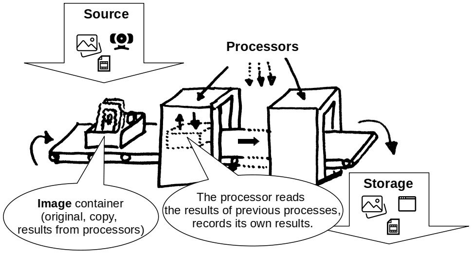

# **Quick Faces**

It is a **framework for experiments with computer vision** algorithms.

It is designed for working with faces but can be used for other types of tasks.

## Licence
**MIT**
## Idea
The idea is to choose for your own experiment:
1) any of the **inputs** (directory with pictures, camera, video),
2) any of the **outputs** (directory, video, a window on the screen)
3) any of the **processors** (programs) or a combination of them that will process the images

</img>

## Debugging

For each process, **the processing time is recorded**, both for individual images and as a whole as **statistics** for the entire process.

## Purpose
There are many published algorithms and here everyone will be able to test them on their data.
Gradually, I will expand the list of usable processes.
I hope that it can be useful for testing different algorithms.

## Data

### Images and videos for experiments
In the root directory of the repository create a directory with name **nogit_data**.

It will be ignored by git.

For example store your images to _nogit_data/from_herman/in_img_ and set storage to output to the _nogit_data/from_herman/out_img_.  

### Models

Models are stored separately in the Dropbox. They are loaded automatically when used (to the nogit_data/models_cache directory).

The framework un-gzip the files automatically to the directory `nogit_data/models_cache`.

## Requirements

I am using **conda** environment with **python 3.8.**

For _insightface_ library is important the library **mxnet** in version **1.6.0.** 
(see https://github.com/deepinsight/insightface for details).

See file **requirements.conda.txt** for all details about my environment.

## Usage
For now, just modify main_example.py and run it:

`python3 main_example.py`

## Versions
Still in development, no stable version yet.

## Todo list (for the near future):
- Wrap the entire process to a **command line** with parameters and/or with a configuration file.
- Improve this documentation
    - command-line examples
    - configuration file examples
    - How to write your own image processor
- add different types **of face detectors**
    - Inspiration can be found there https://github.com/topics/face-detection?o=desc&s=stars
    - **yolo v3**
    - **tracking face detecor** 
    Estimates the position of the face based on the previous location of the landmarks and the direction and speed of movement of these landmarks in history. Either a simple estimate or learning from examples in history. If the history is not known, the classic (and slower) face detector is used.
- add different types **of landmarks predictors (detectors)**
    - **Combination of 3 shape predictors from library dlib** 
    From models for the whole face and separately user-trained models for the left and right part of the face Select the best in each image.
- add image processor, wicht adds legend (information about all processes) to the each image
- and more .... :-)    
    